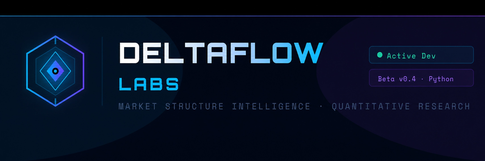

<p align="center">

&#x20; 

</p>


\# DeltaFlow Labs


\*\*AI-Powered Market Structure Intelligence \& Quantitative Research Infrastructure\*\*


DeltaFlow Labs is building intelligent systems for market structure analysis, quantitative research, market intelligence, and trading automation.


\## Vision


Our mission is to help traders, analysts, and businesses make better decisions through data-driven intelligence, automation, and advanced market structure analytics.


\## Focus Areas


\* Market Structure Intelligence

\* Quantitative Research

\* Trading Automation

\* AI-Assisted Analytics

\* Market Intelligence Systems


\## Documentation


\* Architecture

\* Product Overview

\* Roadmap

\* Vision


See the `/Docs` directory for project documentation.


\## Website


https://deltaflow.greenglowcarbon.store


\## Current Status


Development Stage: Active


Core Workstreams:


\* Quantitative Research

\* Market Intelligence Infrastructure

\* Automation Systems

\* Analytics Platform Development


\## Repository Structure


```text

Docs/

Website/

README.md

```


\## Contact


DeltaFlow Labs


Website: https://deltaflow.greenglowcarbon.store


